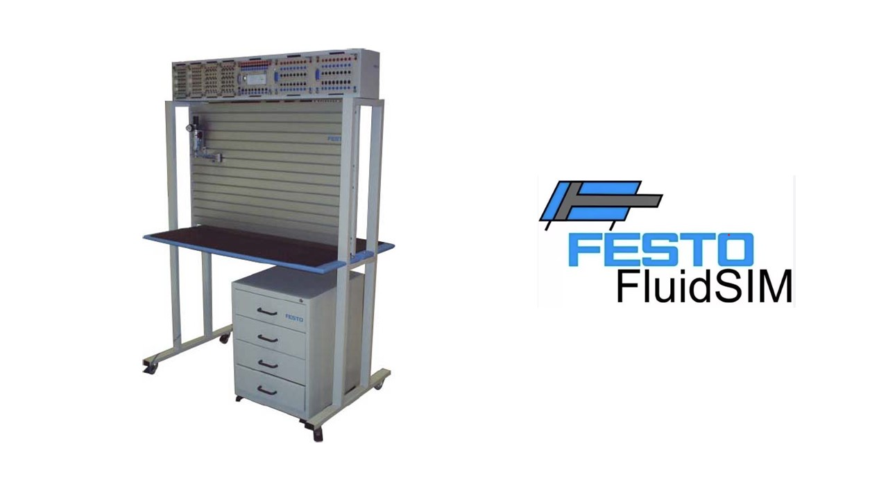

# State University of São Paulo (UNESP)
## Institute of Science and Technology, Sorocaba (ICTS)
### Department of Control and Automation Engineering
### Hydraulic and Pneumatic Circuits

Public Repository for ' Hydraulic and Pneumatic Circuits', a undergraduate course offered by the Department of Control and Automation Engineering at the State University of São Paulo (UNESP), Institute of Science and Technology, Sorocaba (ICTS).

#### Objectives
* Teach the principles of hydraulic, pneumatic, and electropneumatic automation and their applications in the industry.
* Explore the main components of hydraulic, pneumatic, and electropneumatic systems and understand their functions.
* Instruct on how to simulate and design circuits for pneumatic and electropneumatic applications.
* Explain the role and functionality of Programmable Logic Controllers (PLCs) in automation.
* Provide training on programming PLCs for controlling electropneumatic circuits.

#### Evaluation
 Using the FESTO Workstation and FluidSim software, this course is designed to simulate and create pneumatic and electropneumatic circuits, allowing students to connect theoretical knowledge with pratical exercise. Throughout the course, all evaluations are conducted through pratical tasks using the FESTO workstation.

 

#### Prerequisites
 * Basic Knowledge in Physics and Mathematics.
 * Basic Knowledge in Programming.
 * Good Knowledge in Electricity and Electronic.

#### Contact
If you have any further questions, please contact me: dhiego.fernandes@unesp.br

**Week 01: Course Presentation and Introduction of Hydraulic and Pneumatic Circuits**
* Course Presentation 
* Introduction to Hydraulic and Pneumatic Circuits 

**Week 02: FESTO Workstation's Components**
* FESTO Workstation's Components 
* Download FluidSIM 4.2 [here](https://drive.google.com/file/d/1E76SK8L6egDEAmnMtZ1M2xNbtzH5xYvz/view?usp=sharing).
* A tutorial how to install FluidSIM 4.2 

**Week 03 to 06: Pneumatics Circuits**
* Exercise: [Single and Double-Acting Cylinders](./lessons/week_03/) 
* Exercice: [AND and OR Valves, and Step Diagram](./lessons/week_04/)
* Exercise: [Step Diagram and Overlap](./lessons/week_05/)
* Exercise: [Step Diagram with Overlap using 3 Cylinders](./lessons/week_06/)

**Week 08 to 12: Eletropneumatics Circuits**
* Exercise: [Comparison between Pneumatics and Eletropneumatics circuits](./lessons/week_08)
* Exercise: [Double-Acting Cylinder with Proximity Sensors](./lessons/week_09)
* Exercise: [Electropneumatic Circuit A+B+A-B-](./lessons/week_10)
* Exercise: [Electropneumatic Circuit A+B+B-A- with Overlap (B+B-)](./lessons/week_11)

**Weeks 12 and 13: Programmable Logic Controller (PLC)**

* Exercise: [Introduction to the FESTO PLC](./lessons/week_12) 
* Download FESTO FST 4.1 [here](https://drive.google.com/file/d/1FLzshOeWlZKFPCUWvR4jAU40I81NXLMB/view?usp=sharing). **NOTE: If you encounter any installation issues, go directly to the "FST" folder and install FST 4.1 using the FST icon.**
* Video on Configuring FESTO FST 4.1 [here](https://drive.google.com/file/d/1NDSesmh2FgIaR8LIMroWunl9-mZSOVcJ/view?usp=sharing).

