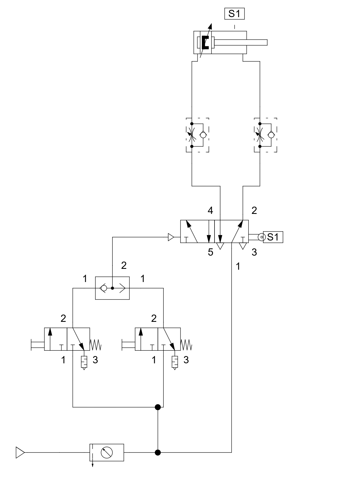
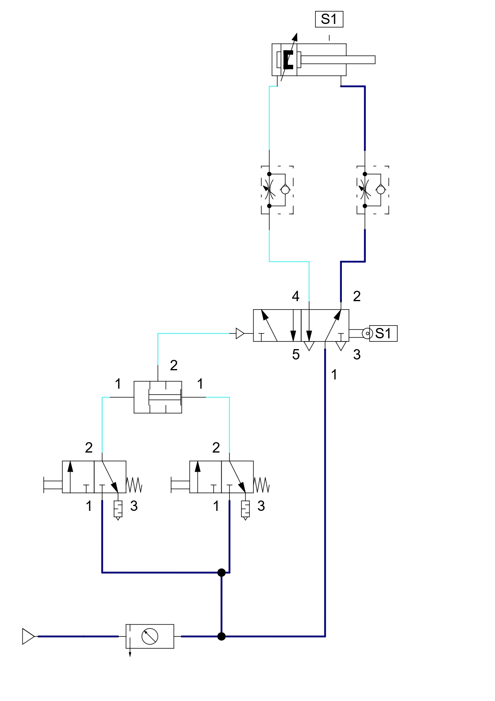
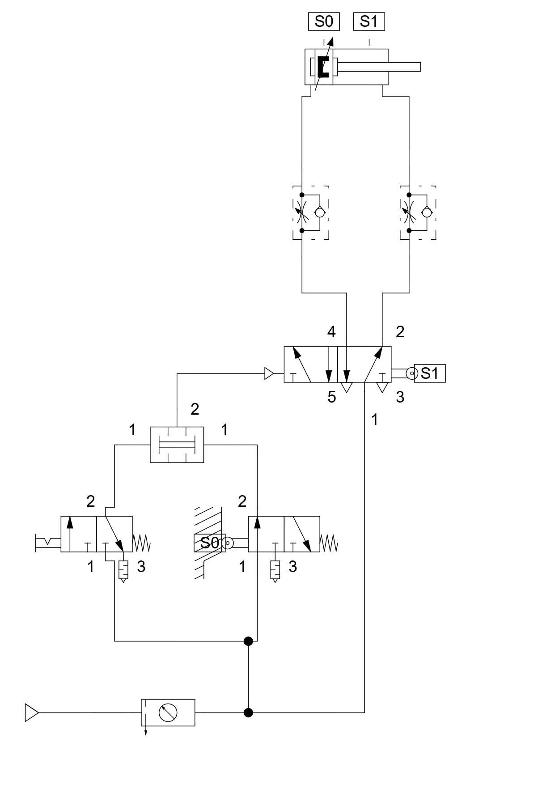
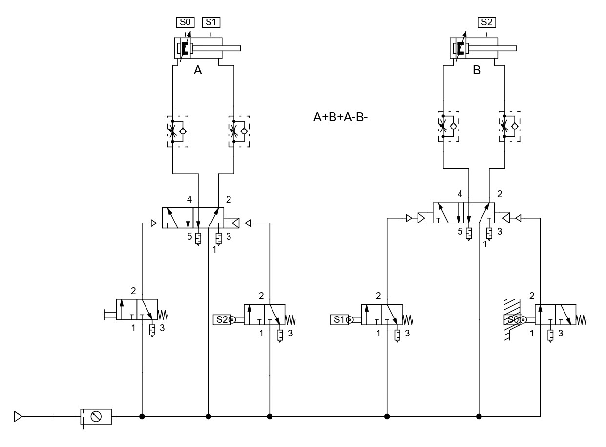

# AND and OR Valves, and Step Diagram

This lesson aims to demonstrate and practice the operation of AND and OR valves, as well as explain what a Step Diagram is and how it works.

## 1. Double-Acting Cylinder with End of Stroke - OR Valve

## 2. Double-Acting Cylinder with End of Stroke - AND Valve

## 3. Double-Acting Cylinder with Start and End of Stroke - AND Valve

## 4. Step Diagram (A+B+A-B-)

