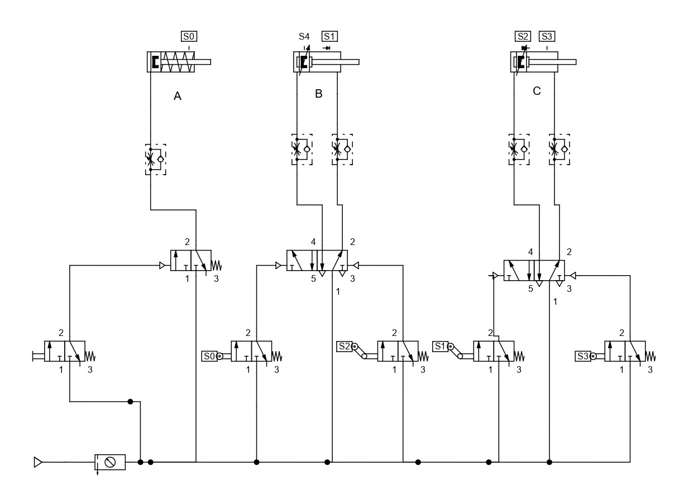
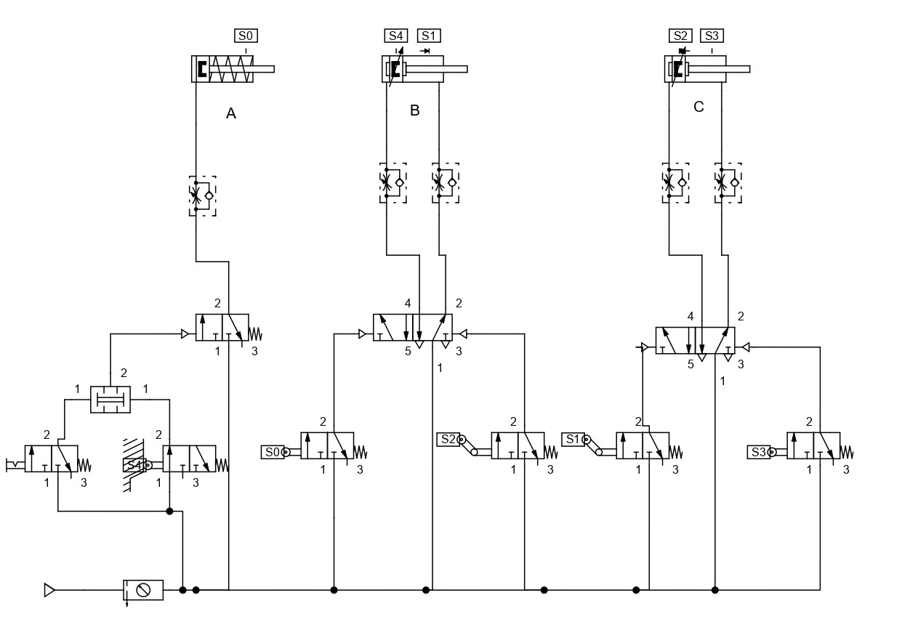

# Step Diagram and Overlap with 3 Cylinders

This lesson aims to demonstrate, simulate, and practice the Step Diagram with overlap using Single-Acting and Double-Acting Cylinders.

## 1. Step Diagram with One Single-Acting Cylinder and Two Double-Acting Cylinders with Overlap
In this case, the first Single-Acting Cylinder (A) initiates the sequence by activating the first Double-Acting Cylinder (B), which then triggers an overlap sequence (B+C+C-B-).

## 2. Step Diagram with One Single-Acting Cylinder and Two Double-Acting Cylinders with Overlap - Continuous Mode
In this scenario, the first Single-Acting Cylinder (A) triggers the first Double-Acting Cylinder (B), initiating an overlap sequence (B+C+C-B-) in continuous mode.

## 3. Step Diagram with Three Double-Acting Cylinders with Overlap (A+B+C+C-B-A-)
Using Fluidsim, simulate a pneumatic circuit with three Double-Acting Cylinders and an overlap sequence (A+B+C+C-B-A-), both in continuous and non-continuous modes.

