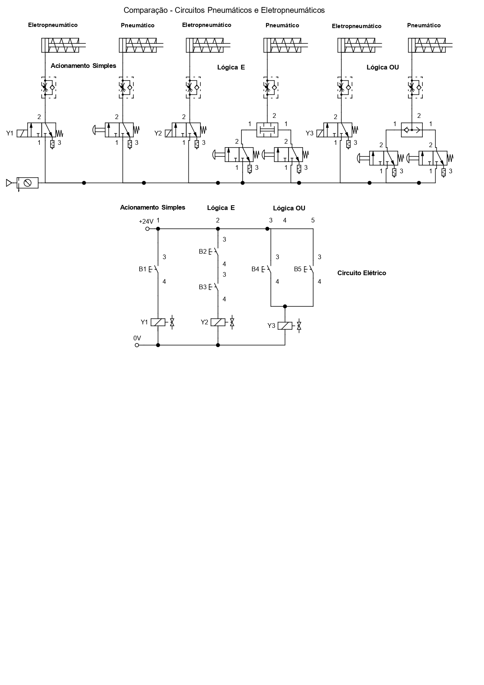

# Comparison Between Pneumatic and Electropneumatic Circuits

This lesson aims to demonstrate the differences between pneumatic and electropneumatic circuits, providing a better understanding of their key operational distinctions and how the electrical circuit interacts with electropneumatic systems.

## 1. Simple Actuation, AND and OR Valves

