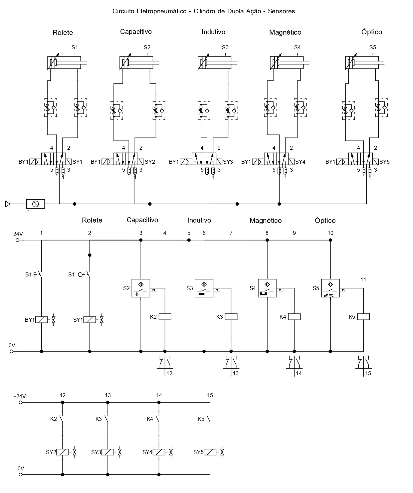

# Electropneumatic Circuit - Double-Acting Cylinder with Proximity Sensors

This lesson aims to simulate and build electropneumatic circuits on a bench using Double-Acting Cylinders with electropneumatic rollers, capacitive, inductive, magnetic, and optical sensors. By doing so, students will understand how each type of sensor operates differently within an electropneumatic circuit.

