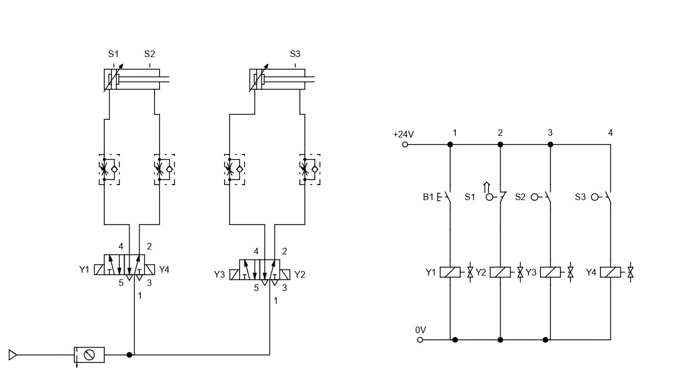

# Electropneumatic Circuit A+B+A-B-

This lesson aims to demonstrate a Step Diagram (A+B+A-B-) using two double-acting cylinders, both with and without proximity sensors.

## 1. Electropneumatic Circuit A+B+A-B-

## 2. Electropneumatic Circuit A+B+A-B- with Proximity Sensors

