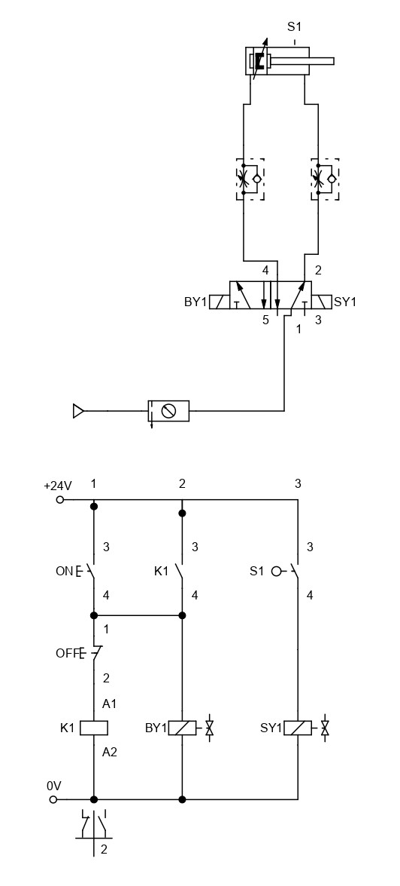
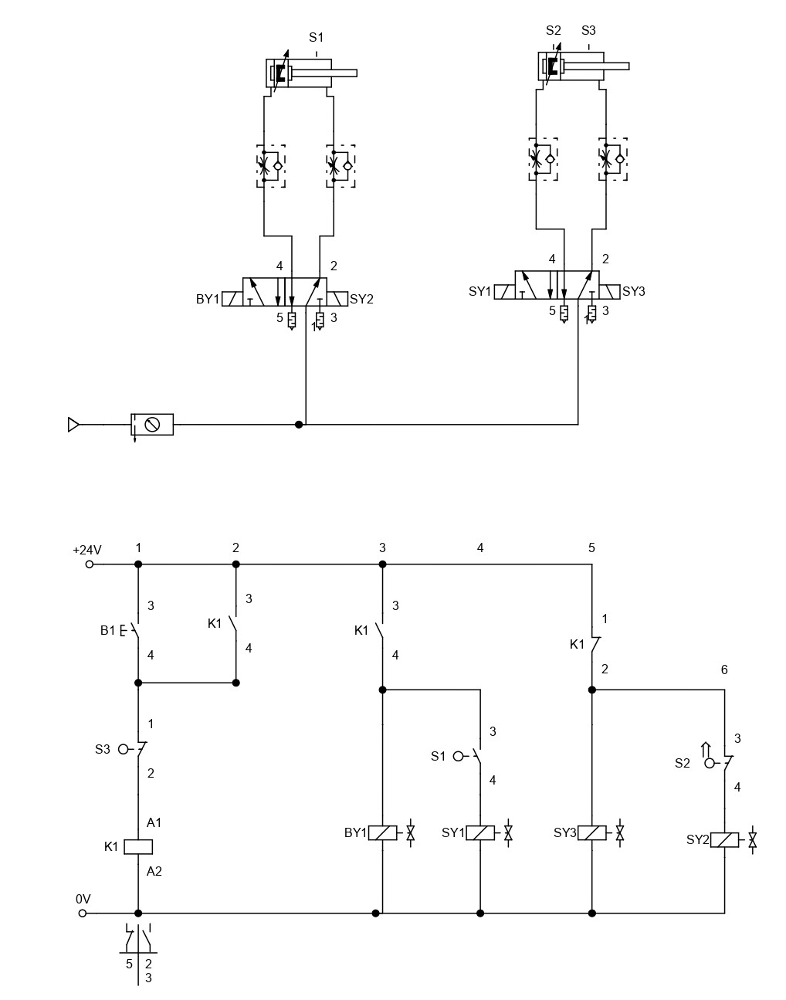

# Electropneumatic Circuit A+B+B-A- with Overlap (B+B-)

This lesson aims to create an electropneumatic circuit with overlap (A+B+B-A-), using a relay latch to solve the overlap issue (B+B-).

## 1. Relay Latch
The electropneumatic circuit below demonstrates how a relay latch is used to assist in the logic of an ON and OFF button, acting as a memory variable.

## 2. Electropneumatic Circuit with Overlap (A+B+B-A-)

Now that the use of a relay latch as a memory variable is understood, it can be applied to solve the overlap issue in the electropneumatic circuit (A+B+B-A-).

