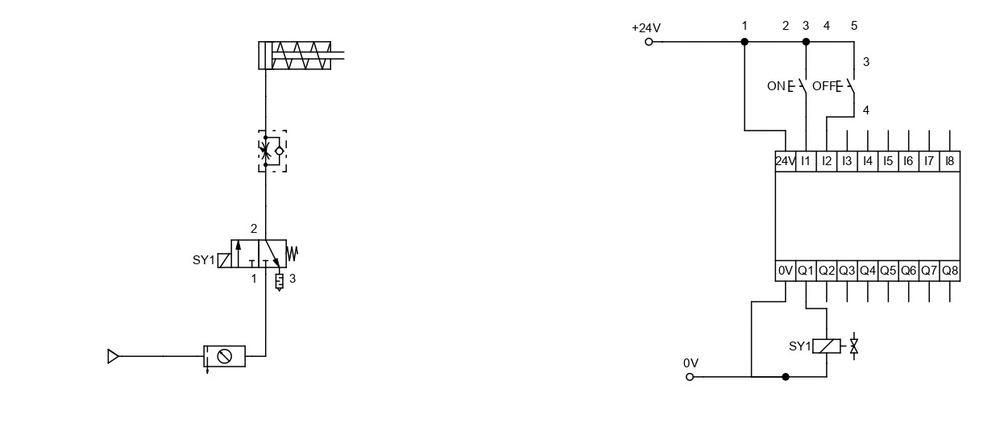
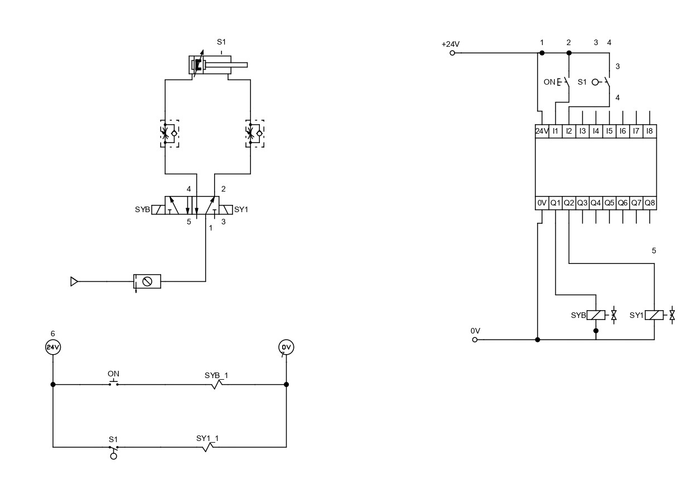
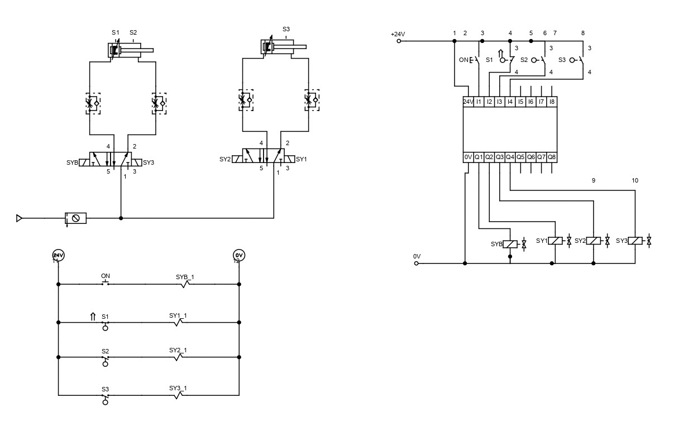

# Introduction to the FESTO PLC

This lesson will cover configuring FST 4.1 on the computer and creating electropneumatic circuits on the FESTO workstation controlled by the FESTO PLC.

## 1. Single-Acting Cylinder with ON and OFF Button using PLC

A simple ON and OFF button setup; here, it is unnecessary to create a relay latch to configure an ON and OFF button for your electropneumatic circuits using the FESTO PLC.

## 2. Double-Acting Cylinder using PLC

A double-acting cylinder with an end-of-stroke sensor using the PLC.

## 3. Step Diagram (A+B+A-B-) with PLC

A Step Diagram (A+B+A-B-) using sensors with the PLC.

