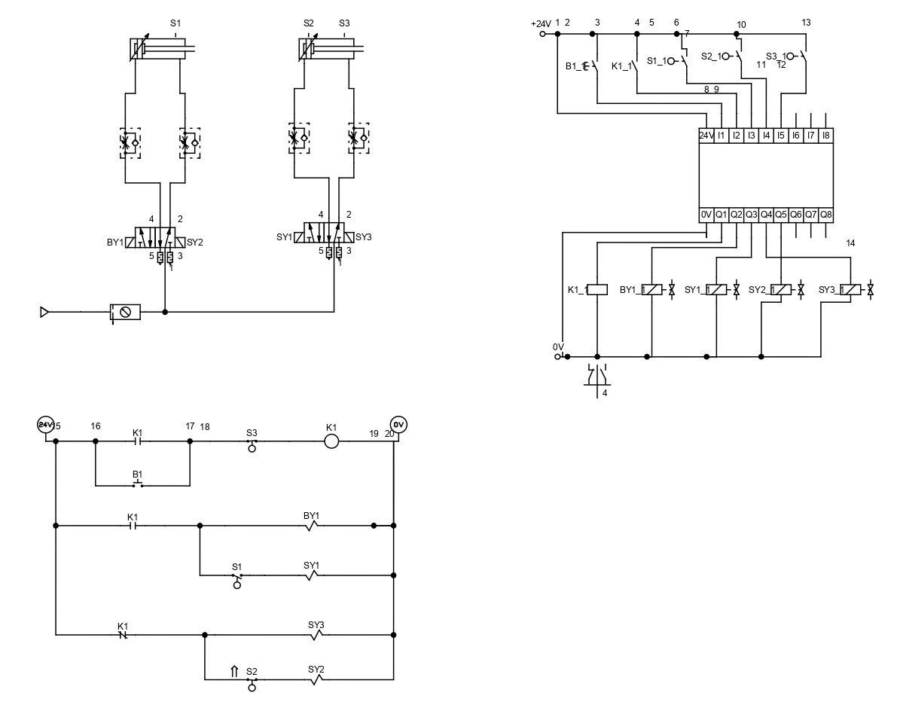

# Step Diagram with Overlap (A+B+B-A-) using PLC

This exercise aims to develop and simulate a Step Diagram with overlap (A+B+B-A-) using the FESTO PLC. The goal is to understand how to manage overlapping actions within an electropneumatic circuit, ensuring accurate sequencing and synchronization between components. Using sensors, the PLC will monitor and control the sequence of two double-acting cylinders, allowing for precise control over each step, including overlap management. 

